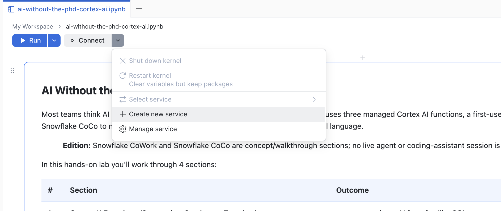
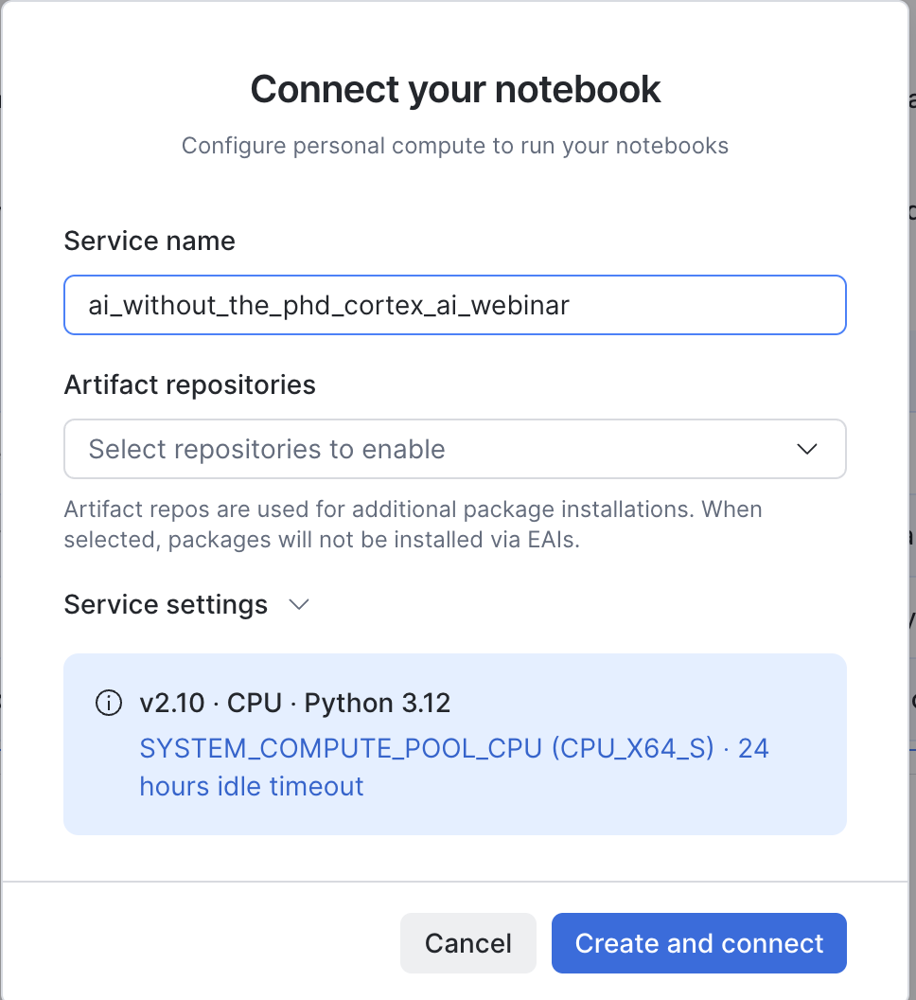
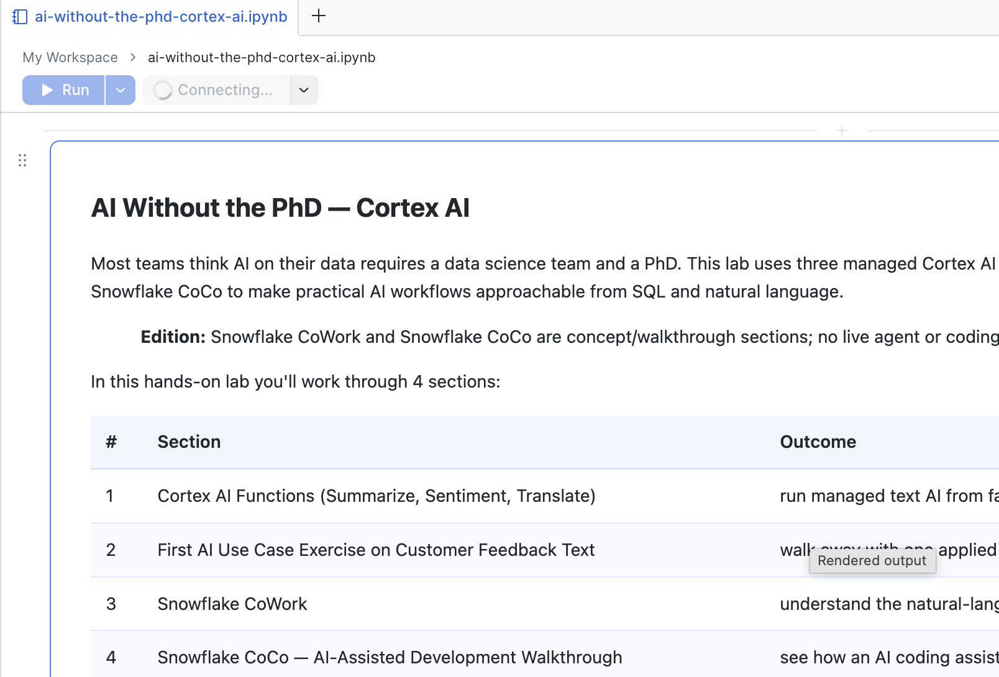
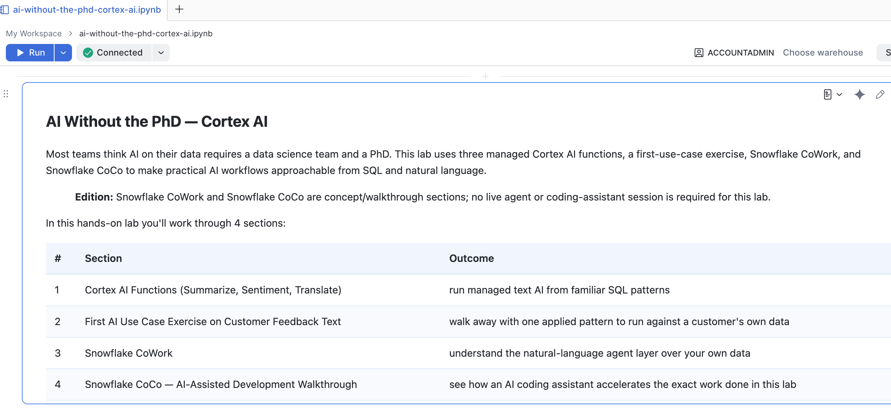
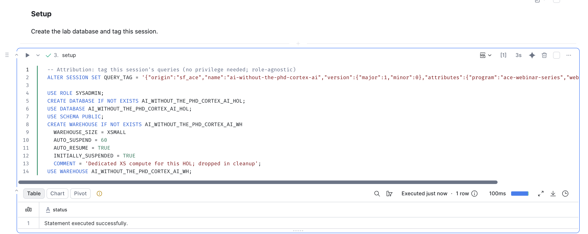

# AI Without the PhD - Cortex AI

A hands-on lab for exploring Cortex AI functions with customer-feedback text,
building a feedback-triage exercise, and introducing Snowflake CoWork and
Snowflake CoCo through guided walkthroughs.

## Format

A self-paced, hands-on lab. Work through the sections in order in your own
Snowflake sandbox. The first two sections contain runnable exercises using
synthetic feedback; the final two are read-through walkthroughs and do not
require a live CoWork or CoCo session.

## Sections

| # | Section | What you'll cover | Hands-on |
|---|---|---|---|
| 1 | Cortex AI Functions | The notebook's summarization, sentiment, and translation examples in SQL | Yes |
| 2 | First AI Use Case | Feedback enrichment, follow-up flags, and a sentiment-distribution chart | Yes |
| 3 | Snowflake CoWork | Natural-language exploration of enterprise data | Walkthrough |
| 4 | Snowflake CoCo | AI-assisted development prompts tied to the lab | Walkthrough |

## Prerequisites

- A Snowflake trial, sandbox, or development account. Do not use production.
- Access to `SYSADMIN`, which the notebook explicitly selects. If your administrator requires another role, adapt the notebook's role statements and permissions before running it.
- Access to a notebook service on an x86 compute pool. Your role needs `USAGE` on the pool, and the pool must permit notebook workloads. Consult the [compute setup](https://docs.snowflake.com/en/user-guide/ui-snowsight/notebooks-in-workspaces/notebooks-in-workspaces-compute-setup) and [limitations](https://docs.snowflake.com/en/user-guide/ui-snowsight/notebooks-in-workspaces/notebooks-in-workspaces-limitations) documentation.
- Access to the AI functions used by the notebook: the account-level `USE AI FUNCTIONS` privilege or the applicable per-function privileges, plus either `SNOWFLAKE.CORTEX_USER` or `SNOWFLAKE.AI_FUNCTIONS_USER`. Confirm availability and access with your administrator using the [AI-function access documentation](https://docs.snowflake.com/en/user-guide/snowflake-cortex/aisql-privileges-and-access).
- Basic familiarity with SQL and reviewing query results.

The Setup cell contains creation statements for the lab database and an X-Small
query warehouse, `AI_WITHOUT_THE_PHD_CORTEX_AI_WH`, then selects that warehouse.
The notebook service uses separate compute. Review its runtime, compute pool,
and idle timeout rather than assuming the screenshot settings suit your account.

The notebook's `cortex_ai_access` cell is comment-only. It does not apply grants;
arrange any missing access with your administrator before the AI exercises.

> **Version note:** this release preserves the supplied notebook, including its
> `SNOWFLAKE.CORTEX.SUMMARIZE` calls. Its linked legacy function-reference URL
> currently opens the `AI_SUMMARIZE` page instead. This package has not been
> runtime-tested as part of release preparation; confirm compatibility in your
> sandbox before using it for a live session.

## How to Run the Notebook

Upload the notebook into **Snowflake Notebooks in Workspaces**, connect a notebook
service, and run the cells in order.

> **Screenshot guide:** the six screenshots below are reused from the
> Getting Data Into Snowflake lab to illustrate navigation. Their notebook
> titles, service names, warehouses, SQL, and displayed results are not this
> lab's. Follow the instructions here and the downloaded notebook, not the SQL
> or runtime settings pictured in the screenshots.

### 1. Download the notebook

Download
[`ai-without-the-phd-cortex-ai.ipynb`](ai-without-the-phd-cortex-ai.ipynb)
from this repository's GitHub file page using **Download raw file**.

### 2. Open Workspaces

Sign in to Snowsight and open **Projects > Workspaces**.

### 3. Select your workspace

Use the workspace dropdown to select **My Workspace**, as illustrated below.

### 4. Upload the notebook

Choose **+ Add new > Upload files**, select the downloaded `.ipynb`, and open it
in the editor. Check that the filename is `ai-without-the-phd-cortex-ai.ipynb`.

### 5. Create the notebook service (compute)

The example UI shows **Connect > Create new service**. Use that control to
configure a service, or select an existing service you are authorized to use.

Use `ai_without_the_phd_cortex_ai_webinar` as a suggested service name. Select
your approved compute pool and runtime settings, review the idle timeout, and
choose **Create and connect**. The dialog below shows a different lab's name.

Wait for the connection to finish. The screenshots illustrate the transition
from **Connecting** to **Connected**, not a guaranteed connection time.

### 6. Run the lab

Review the object names below before running anything. If those names already
belong to another exercise or workload, stop and adapt the notebook consistently.

1. Select `SYSADMIN` and run **Setup** (`setup`). It selects the lab database, `PUBLIC` schema, and query warehouse.
2. Read **Confirm AI Function Access** at the start of Section 1 and resolve missing access before continuing.
3. Work through the runnable cells in Sections 1 and 2 in order, using each cell's run control. Inspect the feedback, translations, summaries, scores, and follow-up flags as you go.
4. Run both **Step 8** cells in Section 2, including the Python cell that draws the sentiment-distribution bar chart.
5. Read the CoWork and CoCo walkthroughs. Their suggested prompts are not automatically submitted by this lab.
6. After inspecting your results, run **Cleanup** (`cleanup_run`). It contains drops for the lab database and warehouse. Do not use **Run all** if you want to keep the lab tables available for inspection.
7. Separately suspend the notebook service when finished: open **Connected**, hover over the service name, and select **Suspend**. The notebook's cleanup SQL does not remove that service.

If you reused a service, check its other connected notebooks before suspending
it; suspension disconnects them and clears their in-memory state.

> **What a successful run looks like:** before cleanup, check for 15 source
> feedback rows and 15 enriched rows after one enrichment run. Inspect that
> translations, summaries, and scores are present before relying on the follow-up
> flags; a completed query alone is not a quality check. The Step 8 Python cell
> should display a bar chart. These are checks for your run, not recorded test
> results for this release.

> **Re-running:** run the table-creation and sample-loading steps again before
> repeating the exercise. The enrichment cell uses `INSERT`, so running it twice
> without recreating the insights table appends another batch. After cleanup,
> start again at Setup rather than jumping into later cells.

## What the Lab Demonstrates

- Applying AI-function examples to synthetic feedback within SQL exercises.
- Using `SNOWFLAKE.CORTEX.SENTIMENT` for English-language sentiment scores. Its score represents polarity and certainty, not sentiment intensity.
- Using `AI_TRANSLATE` to translate between supported languages. The combined enrichment statement translates non-English feedback to English before summarization and sentiment scoring.
- Storing enrichment fields in a table and using the lab's chosen follow-up rule to inspect feedback.
- Introducing CoWork's natural-language interaction with enterprise data and CoCo's AI-assisted development experience, without deploying either in this lab.

Sources:

- [Cortex AI Functions overview](https://docs.snowflake.com/en/user-guide/snowflake-cortex/aisql)
- [Privileges and model access for Cortex AI Functions](https://docs.snowflake.com/en/user-guide/snowflake-cortex/aisql-privileges-and-access)
- [SENTIMENT](https://docs.snowflake.com/en/sql-reference/functions/sentiment-snowflake-cortex)
- [AI_TRANSLATE](https://docs.snowflake.com/en/sql-reference/functions/ai_translate)
- [Snowflake CoWork](https://docs.snowflake.com/en/user-guide/snowflake-cortex/snowflake-cowork)
- [Snowflake CoCo](https://docs.snowflake.com/en/user-guide/cortex-code/cortex-code)
- [Snowflake Notebooks in Workspaces](https://docs.snowflake.com/en/user-guide/ui-snowsight/notebooks-in-workspaces/notebooks-in-workspaces-overview)
- [Editing and running notebooks](https://docs.snowflake.com/en/user-guide/ui-snowsight/notebooks-in-workspaces/notebooks-in-workspaces-edit-run)
- [Notebook compute setup and suspension](https://docs.snowflake.com/en/user-guide/ui-snowsight/notebooks-in-workspaces/notebooks-in-workspaces-compute-setup)

## Object Naming

The notebook uses the database `AI_WITHOUT_THE_PHD_CORTEX_AI_HOL`, the query
warehouse `AI_WITHOUT_THE_PHD_CORTEX_AI_WH`, and two tables in the database's
`PUBLIC` schema: `CUSTOMER_FEEDBACK_TABLE` and `FEEDBACK_INSIGHTS_TABLE`.

Setup uses `IF NOT EXISTS` for the database and warehouse, but cleanup drops
those named objects. Reserve them exclusively for this exercise. The table
creation and loading cells also replace or clear lab data. Review each cell
before running it.

## Series Context

This is the AI Without the PhD lab in the Snowflake activation webinar series.
Its exercises include their own sample data and setup; no data objects from
another webinar are required.

## License

Licensed under the [Apache License 2.0](LICENSE).

## Disclaimer

This repository is a teaching artifact, not an officially supported Snowflake
product. It creates, replaces, clears, and drops objects in the account where
you run it. Use a sandbox rather than production, review every cell, and inspect
AI-generated results before adapting them to an operational workflow. The
synthetic feedback is exercise data, not customer testimony or product guidance.
Run cleanup and suspend the notebook service when finished.